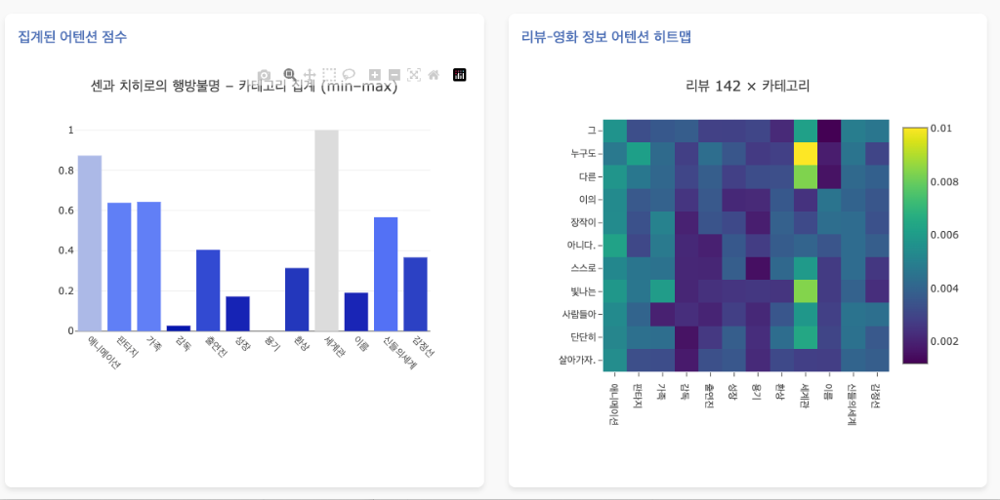
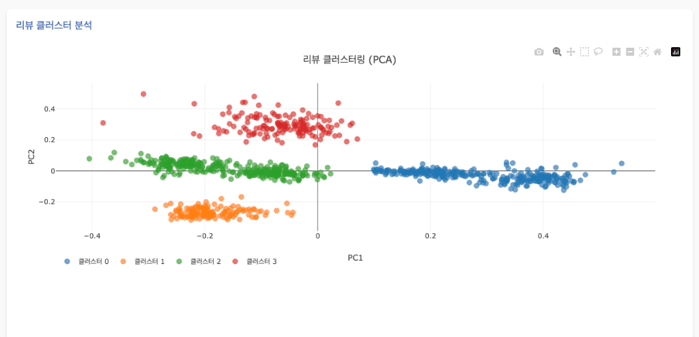
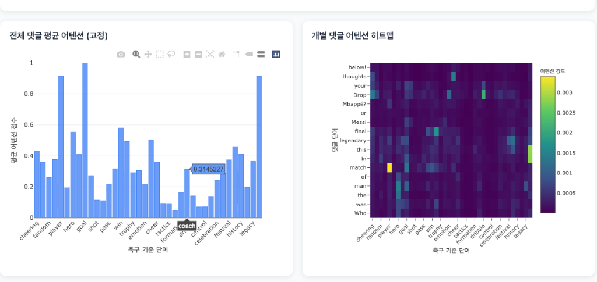

# 🎬 Cross-Domain Attention Analytics Dashboard

### Natural Language Processing – Portfolio Project

**Visualizing Cross-Attention between User Reviews and Metadata in Movies & Sports**


이 프로젝트는 사전 학습된 트랜스포머 모델(KLUE-RoBERTa 등)의 **Cross-Attention 메커니즘**을 활용하여, 사용자의 **리뷰(Review)나 댓글(Comment)**이 대상 콘텐츠의 **어떤 정보(Metadata/Context)**에 주목하고 있는지를 시각적으로 분석하는 대시보드입니다.

초기에는 영화 리뷰 분석을 위해 개발되었으나, 현재는 **스포츠(축구) 등 다양한 도메인으로 확장**하여 팬들의 열광 요소와 관심사를 분석하는 데 적용하고 있습니다.

---

---

## 📊 주요 기능 (Key Features)

### 1. 영화 리뷰 분석 (Movie Review Analytics)

사용자가 작성한 영화 리뷰가 영화의 줄거리, 감독, 배우 등 구체적인 정보 중 어디에 집중하는지 분석합니다.

- **기능**: 리뷰 텍스트와 영화 메타데이터 간의 어텐션 히트맵 시각화, 리뷰 클러스터링(PCA).
- **활용**: 관객이 영화의 어떤 요소(스토리, 연기, 연출 등)에 반응하는지 파악.

<div align="center">
  
  <p><em>Fig 1. Movie Review Attention Heatmap</em></p>
  
  <p><em>Fig 2. Review Cluster Analysis (PCA)</em></p>
</div>

### 2. 스포츠 도메인 확장: 축구 팬 열광 요소 분석 (Football Fan Engagement)

영화 도메인에서 검증된 기술을 스포츠 분야에 적용하여, 경기 후 댓글이 특정 선수나 경기 상황(키워드)에 어떻게 반응하는지 분석합니다.

- **확장성**: 영화뿐만 아니라 즉각적인 반응이 중요한 스포츠 이벤트에서도 텍스트가 가리키는 대상(Target Entity)을 정확히 포착합니다.
- **Deep Dive**: "player", "goal"등 핵심 키워드에 대한 팬들의 주목도를 히트맵으로 시각화하여 **'스포츠 열광 요소'**를 도출합니다.

<div align="center">
  
  <p><em>Fig 3. Football Fan Attention Dashboard</em></p>
</div>

---

## 🛠 기술 스택 (Tech Stack)

- **Model**: KLUE-RoBERTa (Pre-trained Korean Language Model), Cross-Attention Extraction
- **Analysis**: PyTorch, Hugging Face Transformers, Scikit-learn (PCA, Clustering)
- **Visualization**: D3.js, Chart.js (Interactive HTML Reports)

## 🚀 설치 및 실행 (Installation & Usage)

### 필수 요구사항

- Python 3.9+
- CUDA GPU (권장)

### 설치

```bash
git clone https://github.com/yourusername/movie-review-dashboard.git
cd movie-review-dashboard
pip install -r requirements.txt
```

### 실행

이 프로젝트는 Jupyter Notebook을 통해 분석을 수행하고, 결과물을 인터랙티브 HTML 대시보드로 생성합니다.

1. **데이터 분석 및 대시보드 생성**:
   `pretrained_crossattention.ipynb` 노트북을 실행하여 모델 로드, 어텐션 분석 수행 및 HTML 리포트를 생성합니다.
2. **대시보드 확인**:
   생성된 HTML 파일을 브라우저에서 열어 결과를 확인합니다.

   - **영화 분석**: `enhanced_dashboard.html`
   - **축구/스포츠 분석**: `football_attention_dashboard.html`

## 📂 프로젝트 구조

- `movie_data/`: 영화 메타데이터 및 전처리된 리뷰 데이터
- `docs/`: 대시보드 스크린샷 및 문서 리소스
- `*.html`: 인터랙티브 분석 결과 리포트
- `*.ipynb`: 어텐션 추출 및 모델 분석 노트북

---

© 2025 Youngjin Son. All Rights Reserved.
